<!-- 1. [2022.07.13 (수)](#2022.07.13)
2. [2022.07.14 (목)](#2022.07.14)
3. [2022.07.15 (금)](#2022.07.15)
4. [2022.07.16 (토)](#2022.07.16)
5. [2022.07.17 (일)](#2022.07.17)
6. [2022.07.18 (월)](#2022.07.18)
7. [2022.07.19 (화)](#2022.07.19)
8. [2022.07.20 (수)](#2022.07.20)
9. [2022.07.21 (목)](#2022.07.21)
10. [2022.07.22 (금)](#2022.07.22)
11. [2022.07.24 (일)](#2022.07.24)
12. [2022.07.25 (월)](#2022.07.25)
13. [2022.07.26 (화)](#2022.07.26)
14. [2022.07.27 (수)](#2022.07.27)
15. [2022.07.28 (목)](#2022.07.28)
16. [2022.07.30 (토)](#2022.07.30)
17. [2022.08.02 (화)](#2022.08.02)
18. [2022.08.05 (금)](#2022.08.05)
19. [2022.08.06 (토)](#2022.08.06) -->

# 2022.07.13

블랑 1664

    
    - 도수: 5%
    - 특징: 프랑스 스트라스부르 지방의 작은 양조장에서 시작 되었고 정제수, 맥아, 밀, 글루코오스 시럽, 호프추출물, 오렌지껍질, 고수, 천연향료가 들어간 것이 특징
    - 개인평: 고수향은 그렇게 많이 안 나고 오렌지 껍질 향이 강해서 끝맛이 달달한 맥주라 개인적으로 매우 취향
    - 평점: ★★★★★

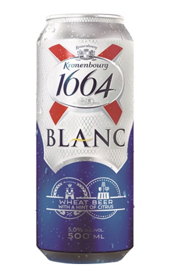
    

# 2022.07.14

테라

    
    - 테라
    - 도수 4.6%
    - 특징: 카스와 마찬가지로 인기가 많은 맥주
    - 개인평: 역시 이런 맥주는 맥주 가게 가서 생맥으로 소맥 말아 먹는게 제일 맛있다
    - 평점: ★★★☆☆
    
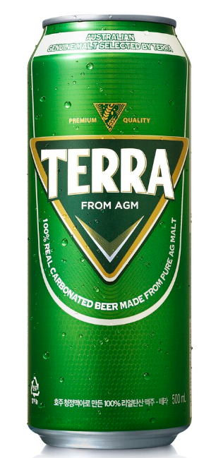

# 2022.07.15

제주 위트 에일 맥주

    - 도수: 5.3%
    - 특징: 제주 감귤 껍질의 상큼함과 섬세한 꽃 향이 나는 맥주
    - 개인평: 귤 껍질 맛이 미세하게 나는 맥주
    - 평점: ★★★☆☆
    
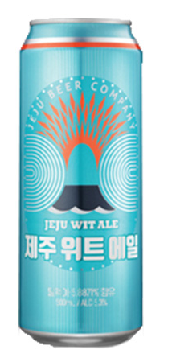

# 2022.07.16

기네스 드래프트 비어

    - 도수: 4.2%
    - 특징: 흑맥주 자체가 조금 기울여두고, 갈색이 검은색으로 바뀌기 시작하는 시점이 가장 맛있는 순간인 만큼 먹는 방법에 따라 맛이 달라지는 맥주
    - 개인평: 귀찮아서 그냥 마셨더니 씁쓸한 맛이 너무 오래 남아서 맛이 없었음.
    - 평점: ★☆☆☆☆
    
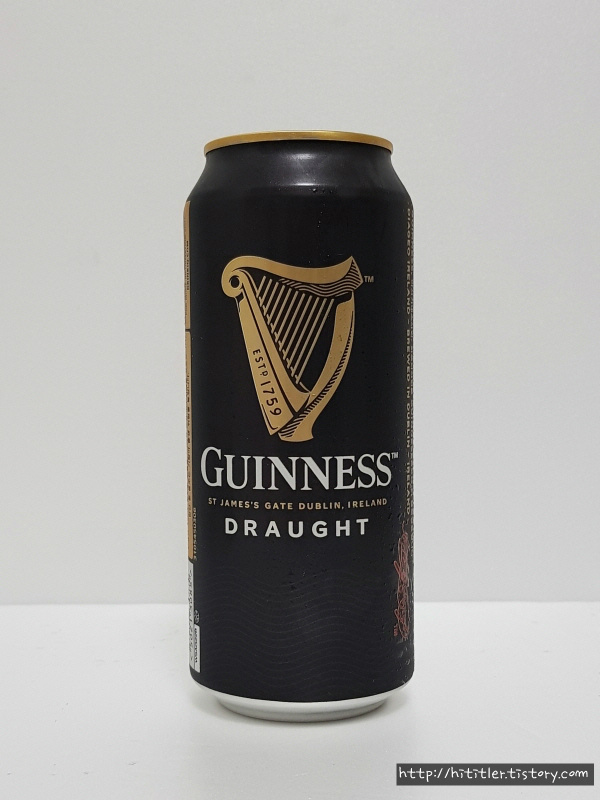

# 2022.07.17

아사히

    - 도수: 5.0%
    - 특징: 일본 맥주이며, 청량하고 끝 맛이 상쾌하다.
    - 개인평: 사실 카스나, 테라랑 비교해서 그렇게 큰 차이가 느껴지지 않으며 가끔 사먹기에 좋은 거 같다
    - 평점: ★★★★☆
    
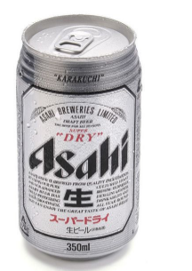

# 2022.07.18

바밤바 막걸리

    - 도수: 4.0%
    - 특징: 일반적인 막걸리보다 도수가 낮고 밤맛이 진하며 달달하다
    - 개인평: 달달하고 맛있지만 끝맛에 조금 이상한 맛이 있다.
    - 평점: ★★★☆☆
    
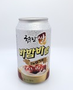

# 2022.07.19

할맥 생맥

    - 도수: ???
    - 특징: 가게에서 마시는 시원한 생맥
    - 개인평: 생맥은 역시 가게에서 직접 마셔야 한다. 시원하고 살짝 블랑과 비슷한 맛이 나서 내 스타일이였다.
    - 평점: ★★★★★
    

# 2022.07.20

클라우드 생 드래프트 맥주

    - 도수: 5%
    - 특징: 탄산이 많은 청량감을 위한 맥주
    - 개인평: 테라, 클라우드, 카스는 눈 가리고 마시면 눈치 못 챌 정도로 맛이 비슷하다 그냥 무난한 맥주
    - 평점: ★★★☆☆

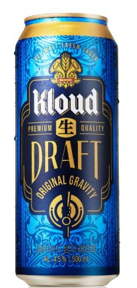
    

# 2022.07.21

기네스

    - 도수: 4.5%
    - 특징: 기네스 드래프트보다 덜 쓰며, 안에 거품을 만드는 볼이 들어있어서 신기하다.
    - 개인평: 기네스 자체가 씁쓸한 맥주라 내 스타일은 아니였다
    - 평점: ★★☆☆☆

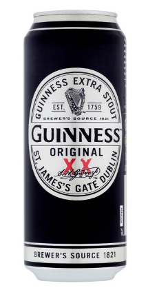
    

# 2022.07.24

순하리 레몬진

    - 도수: 4.5%
    - 특징: 달달한 레몬 맛으로 알콜이 들어간 레모네이드 느낌의 맥주
    - 개인평: 토닉 워터랑 맛이 크게 차이가 없었고, 생각보다 별로였다.
    - 평점: ★☆☆☆☆

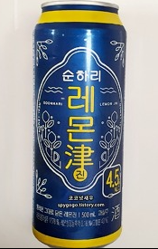
    

# 2022.07.25

Hop House 13

    - 도수: 5.0%
    - 특징: 기네스 회사에서 만든 아일랜드 맥주
    - 개인평: 블랑을 제외하면 제일 맛있다고 해도 과언이 아닐 정도로 맛있었다.
    - 평점:  ★★★★★

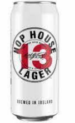
    

# 2022.07.26

호가든 로제

    - 도수: 3.0%
    - 특징: 밀맥주로 라즈베리를 넣어서 만든 로제 맛인게 특징
    - 개인평: 밀맥주 특유의 부드러움은 있으나, 향수를 먹는 맛
    - 평점: ★☆☆☆☆
    
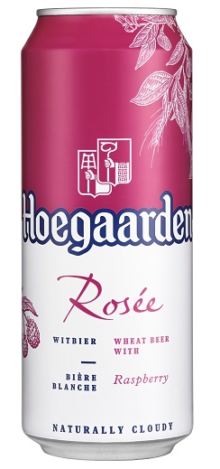
    

# 2022.07.27

호가든 페어

    - 도수: 3.5%
    - 특징: 여름 한정으로 나온 서양배 과즙을 넣은 상큼한 밀맥주
    - 개인평: 배맛은 모르겠고 청포도? 청사과 맛이 나는 맛 개인적으론 달달한게 음료수 느낌이라 맛있었음
    - 평점:  ★★★☆☆
    
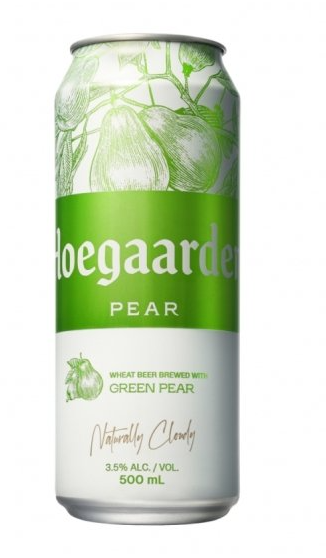
    

# 2022.07.28

호가든

    - 도수: 4.9%
    - 특징: 벨기에 대표적인 밀맥주 중 하나로 밀맥주 특성상 한 번 따르고, 흔들어서 효모(거품)까지 싹 마셔주는게 특징
    - 개인평: 블랑이랑 비교적 비슷한 맛을 내지만 블랑 보단 향이 약해서 완전 내 취향은 아니였다
    - 평점: ★★★★☆
    
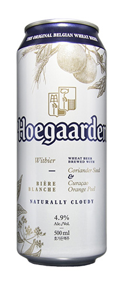
    

# 2022.07.30

호가든 보타닉

    - 도수: 2.5%
    - 특징: 은은한 꽃향기를 담아낸 밀맥주
    - 개인평: 호가든 로제가 향수를 먹는 맛이였다면, 호가든 보타닉은 방향제를 먹는 맛
    - 평점: ★☆☆☆☆
    
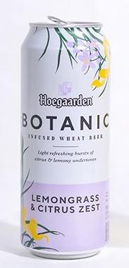
    

# 2022.08.02

광화문

    - 도수: 5.0%
    - 특징: 에일 맥주로 맥문동을 함유해 4주간 상면발효 시킨 맥주
    - 개인평: 씁쓸한 귤 껍질 맛이 나는 맥주, 개인적으로 쓴 맛이 조금 약했으면 좋겠다
    - 평점: ★★☆☆☆
    
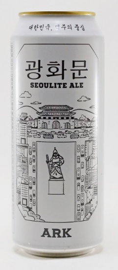
    

경복궁

    - 도수: 5.0%
    - 특징: 광화문 맥주와 제주 백록담 에일을 연이어 출시하면서 수제맥주 열풍에 맞추어 나온 프리미엄 수제 맥주
    - 개인평: 광화문을 먹고 먹어선 모르겠지만 굉장히 맛있음
    - 평점: ★★★☆☆
    
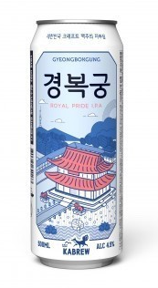
    

# 2022.08.05    

OB라거

    - 도수: 4.6%
    - 특징: 옛날에 굉장히 유명했던 맥주로, 뉴트로 열풍으로 다시 판매중인 맥주
    - 개인평: 막 엄청 맛있다는 느낌은 안 들었지만 진짜 시원하게 다시 마시면 생맥주 느낌이 나서 맛있을 거 같았다
    - 평점: ★★★☆☆
    
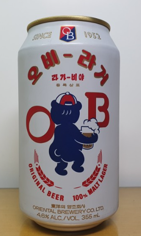
    

# 2022.08.06   

한맥

    - 도수: 4.6%
    - 특징: 쌀을 담아 만든 맥주로, 부드럽고 깔끔한 풍미의 팟이 일품인 맥주
    - 개인평: 야구장에서 다 식은 맥주를 마셔서 그런지 무슨 맛인지 하나도 모르겠다 (나중에 다시 먹어보든 해야할 듯)
    - 평점: ★★☆☆☆
    
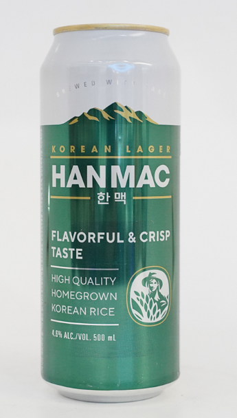

# 2022.08.09

성산일출봉 에일

    - 도수: 5.1%
    - 특징: 제주 맥주 중 나온 하나로 독일의 맥주 순수령 기준에 부합하게 만들어짐
    - 개인평: 일반적인 맥주 맛이였는데 의외로 쓴 맛이 강했다 하지만 맛이 독특해서 또 먹어볼만함
    - 평점: ★★★☆☆
    
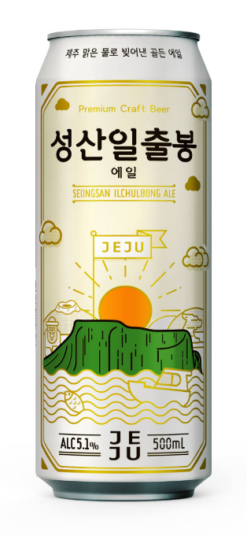
    

# 2022.12.15

매화수 (초록병)

    - 도수: 12%
    - 특징: '저온 냉동 여과공법'을 사용해 부드럽고 깨끗한 맛!
    - 개인평: 매실 음료를 먹는 맛 맛은 있고 도수도 적당히 있어서 기분이가 좋아지는 맛
    - 평점: ★★★★☆
    
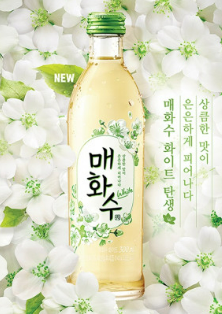
    

# 2022.12.16

버드와이저

    - 도수: 5%
    - 특징: 버드와이저는 발효액을 저온에서 7~12일 가량 발효시킨 후, 다시 0℃ 이하에서 1~2개월가량 숙성시킨 라거
    - 개인평: 사실 무슨 특징이 있는지는 모르겠는데 카스나 테라에서 나는 특유의 맥주 맛이 나지 않고 깔끔해서 좋았다
    - 평점: ★★★★☆
    
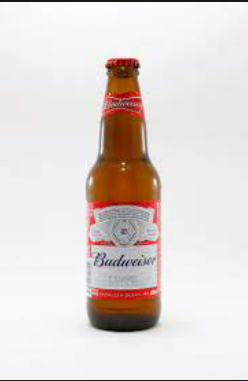
    

# 2022.12.17

원소주

    - 도수: 24%
    - 특징: 술맛이 깔끔하고 목 넘김이 부드럽다. 감압증류(대기압보다 낮은 압력에서 증류)한 술의 특징이다
    - 개인평: 소주보단 비싸고 사케보단 싼마이가 나는 맛 개인적으로 이 돈 좀 더 모아서 사케 먹을 듯
    - 평점: ★★☆☆☆
    
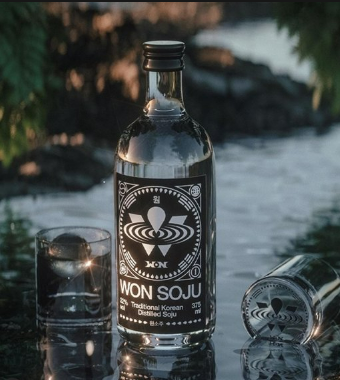
    

