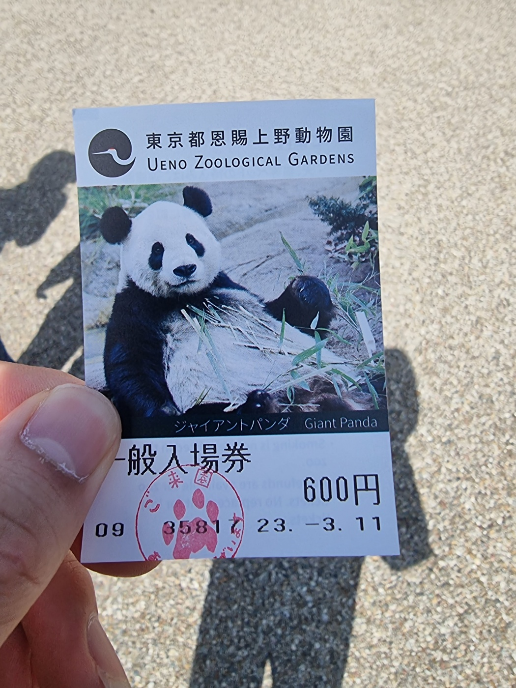
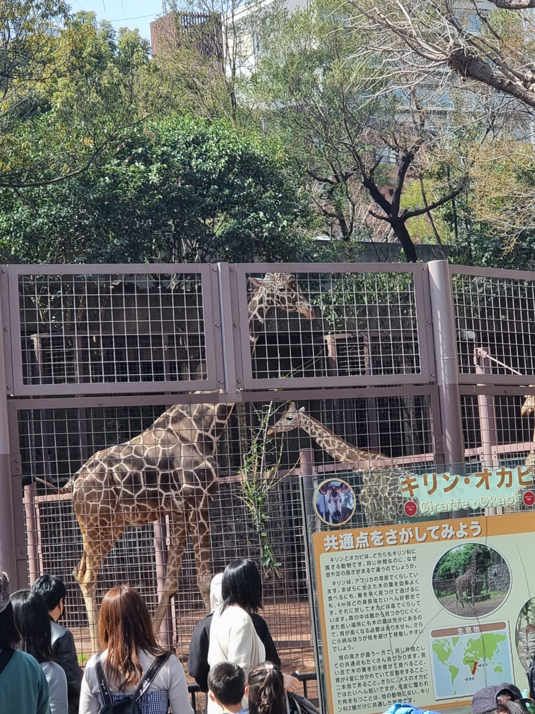
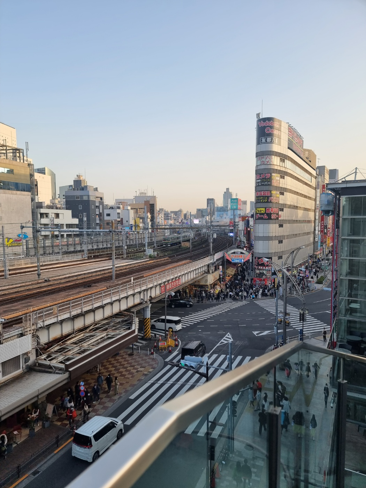

## 시작글 

---

성인 이후 첫 해외 여행을 다녀온 내용을 담고 있는 글
원래 목적은 WBC 관람이였지만 그것보다 다른 게 더 재밌었던 여행

간단한 일행 설명

    - 나: 최광혁. (기초적인 일본어 가능)
    - 두산: WBC를 가자는 목적 하나로 같이 가게 된 일행 (한자 읽기 가능)
    - 동생: 두산 동생으로 마찬가지로 야구를 좋아해서 WBC를 보러 가자는 목적으로 합류 (대화가 통할 정도에 일본어 가능)
    - 명예 일본인: 오사카에서 유학 중인 친구로 같이 여행을 가진 않았지만 여행 하는 내내 급하게 통역이 필요하거나 아키하바라 맛집 혹은 다양한 부분에서 도움을 주는 도우미 역할 (일본인 수준)

## 여행 준비

---

일본 여행을 준비하는 과정은 생각보다 별 건 없었다.
가는 목적 자체가 정해져 있다 보니까 4박 5일중 일단 하루는 WBC를 볼 것이라 생각을 하고 나머지 4일을 정하면 됐으며 그 조차도 일본 자체가 생소하다 보니 갈 곳이 많아서 오히려 5일이 부족하다라고 생각을 할 정도였다.

오히려 문제는 비행기 표와, 숙소였고 도쿄돔과 가까우면서도 접근성이 좋은 숙소와 성수기라 그런지 미쳐 날뛰는 비행기 표 중에 그나마 싼 비행기 표를 구하는 것으로 시작 했고 그나마 싸고 좋은 티켓과 우리가 가려고 하는 일정과도 문제 없을 위치인 아키하바라 주변에 숙소를 구하게 되었다

아 그리고 이건 좀 신기했던건데 비행기 표도 삼성페이에 등록이 된다

<!--  -->

## 03.10 (금)

---

- 날씨: 안개(대한민국), 맑음(일본)

### 출발

여러 준비를 마친 뒤 첫 여행 날짜가 다가왔고 가기 하루 전에 들었던 생각은 생각보다 단순하게 "인천 공항까지 어떻게 가지" 였다. 일행과 공항에서 만나기로 한 시간이 10시였는데 그럼 집에서 7~8시에는 출발을 했어야 했고 그 시간에는 출근 시간이라는 걸 간과 하고 있었던 것이다 출근 시간에 그 큰 캐리어를 들고 민폐를 끼치고 싶진 않았기 때문에 그냥 공항 철도 시간을 8시로 앞당기고 집에선 6시에 출발을 해서 10시보다 1시간 더 일찍 도착하는 미친 계획을 세우고 갔다

**(이후에 알았지만 공항 버스는 우리 집 앞을 지나갔다) <  걍 이거 탔으면 됐음** 

뭐 어쨌든 공항엔 잘 도착해서 이것 저것 봤는데 인천 공항은 진짜 할 게 없는 곳이였고 쓸데없이 커다란 곳이였다
너무 일찍 도착한 나머지 공항을 구경을 하면서 평소에 필요했던 보조 배터리도 사고 주변에 누워서 주무시는 분들도 구경하고 했는데 할 게 너무 없어서 나도 옆에서 같이 자고 싶다는 고민을 계속 하다가 일행들을 만나서 밥을 먹고 시간에 맞춰서 비행기를 탔다

출발

서울역 -> 인천 공항

대충 비행기에서 찍은 사진들

### 도착

예상대로 한국인이 많을거라 생각을 했지만 무슨 입국 심사만 2시간 가까이 걸릴거라곤 생각하지 못 했다
덕분에 일본 숙소 측에서는 계속 영어로 언제 오냐고 물어보는데 시간이 계속 미뤄져서 늦을 거 같아서 미안하다는 연락만 계속 보냈었다 근데 생각해보니까 내 돈 내고 가는건데 내가 왜 사과 했는지는 모르겠다

입국심사 이후에도 문제였던게 일본에서 WBC 볼 생각만 했지 교통편조차 생각하지 못 했던 머저리 삼인방은 숙소까지 갈 방법을 찾아봤고 결국에는 명예 일본인한테 물어봐서 게이세이 열차 대충 일본에 있는 공항철도를 타고 우에노 역으로 가기로 했다 물론 그 이후에도 아키하바라까지 가는 열차를 타고 갔어야 했는데, 첫 날이라 일본 지하철이 너무 무서웠던 나머지 우에노역에서 숙소까지 걸어가기로 했다

### 저녁

아침 6시부터 일어나서 비행기를 타고 일본에 가서 숙소에 도착 하니 8시가 되어 있었다.
어차피 계획이란게 없어서 크게 상관은 없었는데 문제는 일본은 6시만 되어도 가게들이 닫기 시작하는 직원 입장에선 개꿀이고 손님 입장에선 미칠 거 같은 곳이기 때문에 급하게 밥 먹을 곳을 찾았어야 했다.

다행이도 이 조차 명예 일본인한테 물어봐서 맛있고 오래하는 라멘집을 찾아서 갔었다
추가로 일본은 맥주가 그렇게 맛있다고 해서 라멘을 먹고도 못 참고 맥주를 두 캔을 샀다 (배불러서 안주는 안 삼)

장가라 라멘

<iframe src="https://www.google.com/maps/embed?pb=!1m18!1m12!1m3!1d405.0042440974584!2d139.77037005829578!3d35.700782085191975!2m3!1f0!2f0!3f0!3m2!1i1024!2i768!4f13.1!3m3!1m2!1s0x60188c1dcea2d1f7%3A0xdb4fb9ee996c3ab8!2z7YGQ7IqIIOyepeqwgOudvCDrnbzrqZgg7JWE7YKk7ZWY67CU65287KCQ!5e0!3m2!1sko!2skr!4v1681317123193!5m2!1sko!2skr" width="600" height="450" style="border:0;" allowfullscreen="" loading="lazy" referrerpolicy="no-referrer-when-downgrade"></iframe>

맥주

맥주에 대한 자세한 평가는 맥주탭에서 확인 (언젠간 추가 될 예정)

녹차 맛 맥주

밀키스 맛 맥주

### 첫날 마무리

첫 날이라 그런지 굉장히 정신 없이 보낸 하루였고 그냥 일본 도착해서 밥먹고 나니 하루가 끝나 버렸고, 진짜 당황하니까 기초적인 일본어도 자꾸 헷갈려서 대화 하기 힘들었다 (물론 이건 여행 하는 내내 고치지 못 했다)

추가로 이 날 대한민국은 당연히 이길 줄 알았던 호주한테 져서 8강 진출이 어려워진 상황이였다.

## 03.11 (토)

---

- 날씨: 맑음(일본)

### 아침

이 날은 아침부터 바쁘게 움직일 생각을 하고 숙소 앞에서 9시 30분에 만나기로 했었다
현실은 9시에 일어나서 그냥 10시에 만나기로 일정을 미루고 10시에 만나는 걸로 하루를 시작했다

### 우에노 공원

우리는 일본에 WBC랑 스카이 타워 말고는 관심도 없었기 때문에 아무것도 할 게 없었던 토요일에 뭐할까 할 일을 찾아보다가
주변에 우에노 공원이 있고, 그 안에 동물원이랑 박물관이 있다길래 할 것도 없는데 동물원이랑 박물관이나 가자는 생각으로 대충 일정을 짜서 10시부터 2시까지는 동물원 그 이후엔 밥을 먹고 박물관을 가자는 생각을 가지고 우에노 공원으로 갔다

### 동물원

우선은 10시에 개장한다는 우에노 공원 안에 있는 동물원을 갔다. 다행이도 주말 치고는 사람이 많이 없었고, 입장 하는데는 큰 문제가 없었다. 근데 작은 문제가 하나 있었는데 그건 동물원이 너무 커서 하루를 그냥 날 잡고 둘러 봤어야 할 크기라 3시간 만에 다 보는건 어려움이 있었고 그러다 보니 처음에는 별 생각 없이 여유롭게 보다가 시간이 가면 갈 수록 바쁘게 움직이면서 봤던 거 같다 그래서 원래 점심도 밖에서 맛있는 걸 먹으려고 했지만 그냥 동물원 안에 있는 식당에서 대충 먹었다

규모도 규모인데 볼거리도 진짜 많았고 3시간 동안 보기에 많이 컸던지라 마지막쯤에는 사진만 대충 찍고 넘어갔었는데 생각보다 아쉬움이 남았다 나중에 기회가 되면 하루 날 잡고 판다까지 제대로 보고 오고 싶다

동물원 사진

동물원 티켓 (판다가 보기 어려워서 그런지 판다 관련 된 내용이 진짜 많았다)

동물원에서 2층으로 올라가는 언덕을 올라가니 보이는 풍경 (대충 여기서 다들 사진 찍길래 따라 찍었음)

일반 원숭이들

쥐인지 뭔진 모르지만 대충 쥐처럼 생김 뒤에 줄이 너무 많아서 자세히 보질 못 했다

진짜 새가 제일 많이 보였는데 그 중에 나를 쳐다보고 있는게 재밌어서 찍었다

날씨가 너무 더워서 없을 줄 알았는데 오히려 밖에서 산책을 즐기고 있는 북극곰

이 더운 날씨에 바깥에서 낮잠을 자는 물범 (정확한 종은 모르겠다)

코끼리

중간에 너무 목이 말라서 마진 복숭아 맛이 나는 물 진짜 맛있어서 자판기에서 이게 보일 때 마다 하나씩 사먹었다

낮잠자는 새끼 곰 너무 귀엽게 자는거에 비해서 발톱은 누구보다 무섭게 생긴게 신기했다

도플라밍고

실제로 처음 보는 기린인데 진짜 상상이상으로 거대했다

무슨 동물인지는 모르는데 진짜 동물원에서 제일 귀여웠다

<iframe src="https://www.google.com/maps/embed?pb=!1m18!1m12!1m3!1d103660.70428730319!2d139.62712214335934!3d35.7164535!2m3!1f0!2f0!3f0!3m2!1i1024!2i768!4f13.1!3m3!1m2!1s0x60188c28f7766d7f%3A0x76b8b5efa1988ef4!2z7Jqw7JeQ64W4IOuPmeusvOybkA!5e0!3m2!1sko!2skr!4v1681633972950!5m2!1sko!2skr" width="600" height="450" style="border:0;" allowfullscreen="" loading="lazy" referrerpolicy="no-referrer-when-downgrade"></iframe>

### 도쿄 국립 박물관

동물원을 다 보고 나와서 바로 이동한 국립 박물관 사실 일본 역사라던가 이런거에 대해서는 무지한 사람이기 때문에 가도 재미가 없을 거라 생각을 했지만 생각보다 볼 게 많았고 재밌었던 곳

그리고 박물관이다 보니 하나하나 사진을 찍기 눈치가 보였던 곳이라 동물원에 비하면 사진은 별로 없지만
첫 기념품도 사고 나름 재밌었던 곳이다

박물관 사진

박물관 티켓 (따로 찍은 사진이 없고 동물원 티켓이랑 같이 찍은 사진만 있다)

안 믿기겠지만 박물관 정면 사진을 멀리서 찍은 거다

펭귄 모형 그냥 귀여워서 찍었다

드래곤 모형 마찬가지로 그냥 멋있어서 찍었다

옛날 높으신 분들이 타고 다니셨던 것

그 시절 일본 갑옷 워낙 영화에서 많이 봤던 디자인이라 뭐가 다른건진 모르겠지만 밑에 쓰여있는 설명을 읽는 재미가 있었다

그 시절 일본 갑옷 워낙 영화에서 많이 봤던 디자인이라 뭐가 다른건진 모르겠지만 밑에 쓰여있는 설명을 읽는 재미가 있었다

<iframe src="https://www.google.com/maps/embed?pb=!1m18!1m12!1m3!1d25914.401526407182!2d139.74037878635036!3d35.718835100000014!2m3!1f0!2f0!3f0!3m2!1i1024!2i768!4f13.1!3m3!1m2!1s0x60188e8314d77d11%3A0x232fd618bd4977dd!2z64-E7L-EIOq1reumveuwleusvOq0gA!5e0!3m2!1sko!2skr!4v1681634677345!5m2!1sko!2skr" width="600" height="450" style="border:0;" allowfullscreen="" loading="lazy" referrerpolicy="no-referrer-when-downgrade"></iframe>

### 그 이후

일본은 평균적으로 가게들이 닫는 시간이 굉장히 이르기 때문에 5~6시쯤 되니 가게들이 문을 닫기 시작했고 우리는 비교적 이른 시간에 저녁을 먹으러 가기로 했다.
저녁은 주변에 생각해 둔 음식점이 없어서 구글링을 통해 마음에 드는 식당을 찾았고, 그 결과 음식점들이 같이 있는 상가를 찾아서 들어갔다.

맛은 그냥 평범한 돈까스와 카레 맛이였지만 일단 일본에 먹는다는 느낌이 좋았고 그 이후에 옥상으로 통해 나와 걷는 산책로는 걷는 사람 기분을 좋게 만들어주는 기분 좋은 날씨여서 산책을 즐기다 숙소로 들어갔다

그 이후 찍은 사진

저녁 메뉴

카레 가게에서 찍은 풍경 너무 일본 느낌이 나서 찍었다

건물 옥상에서 찍은 풍경 위에서 바라보는 풍경은 느낌이 다르다

저녁을 먹고 숙소로 돌아가는 길에 찍은 벚꽃

<iframe src="https://www.google.com/maps/embed?pb=!1m18!1m12!1m3!1d809.8928046094849!2d139.77400290808032!3d35.71216782930626!2m3!1f0!2f0!3f0!3m2!1i1024!2i768!4f13.1!3m3!1m2!1s0x60188e9ddd12dcbd%3A0x3efec6a6d0dbda07!2z7Jik67SJIOuTnCDqs6Dtla0g7Jqw7JeQ64W47KCQ!5e0!3m2!1sko!2skr!4v1686304315634!5m2!1sko!2skr" width="600" height="450" style="border:0;" allowfullscreen="" loading="lazy" referrerpolicy="no-referrer-when-downgrade"></iframe>

### 저녁

저녁 식사 후에 산책을 즐기고 숙소로 돌아오니 시간이 7~8시쯤 되는 굉장히 이른 시간이였기 때문에 이대로 하루를 마무리 하기엔 아쉬움이 있어서 숙소 앞에 있는 아키하바라 거리 산책을 나갔다.
확실히 첫 날에 봤던 어두컴컴한 아키하바라 거리에 비하니 우선 굉장히 밝았고 시끌시끌한게 이게 진짜 아키하바라구나 싶었다.

나가서 마땅히 할 걸 정하지 않았기 때문에 명예 일본인한테 추천받은 햄버거 가게를 갔었다. 일본까지 가서 무슨 햄버거냐 할 수도 있지만 실제 먹어본 햄버거와, 감자튀김에 퀄리티는 한국에서는 도저히 맛볼 수 없는 맛이였고 아직도 내가 지금까지 먹어본 햄버거 중에 최고라고 고를 정도이다.

그리고 이후에는 도로 주변을 걷다가 적당히 어두워지기 시작해서 대충 주변 거리 사진을 찍고 맥주를 사서 돌아온 후에 맥주와 함께 하루를 마무리했다.

저녁 사진

햄버거

저녁 풍경

깊은 맛이 느껴졌고 목넘김이 굉장히 마음에 들었던 맥주 맛은 카스, 테라와 비슷했던 거 같다

햄버거 가게 위치
<iframe src="https://www.google.com/maps/embed?pb=!1m18!1m12!1m3!1d222.02161701268554!2d139.77171085113778!3d35.70128571207323!2m3!1f0!2f0!3f0!3m2!1i1024!2i768!4f13.1!3m3!1m2!1s0x60188c1de9231091%3A0xce06bd532388c1ee!2z7Lm87IqkIOyjvOuLiOyWtA!5e0!3m2!1sko!2skr!4v1686305027027!5m2!1sko!2skr" width="600" height="450" style="border:0;" allowfullscreen="" loading="lazy" referrerpolicy="no-referrer-when-downgrade"></iframe>

### 둘째날 마무리

첫 날이라 그런지 굉장히 정신 없이 보낸 하루였고 그냥 일본 도착해서 밥먹고 나니 하루가 끝나 버렸고, 진짜 당황하니까 기초적인 일본어도 자꾸 헷갈려서 대화 하기 힘들었다 (물론 이건 여행 하는 내내 고치지 못 했다)

추가로 이 날 대한민국은 당연히 이길 줄 알았던 호주한테 져서 8강 진출이 어려워진 상황이였다.

