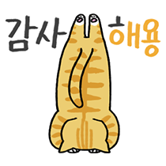

## 시작글

---

2024년을 마무리하는 회고록 내가 이걸 벌써 4번째로 적는거라는게 실감이 나지 않는다.
이게 진짜라면 나는 블로그를 4년 전에 만들었다는 소리 아닌가....

잡설은 그만하고 시작 해보도록 하자

## 2024년 있었던 일

---

2024년은 내 모든 해 보다 한 일이 많은 일이다.

최근들어 나이를 먹으면 먹을 수록 해보는 게 많고 자주 놀러다니는 거 같은데,
(이게 진짜 늦바람이 무섭다는게 무슨 말인지 알 거 같은 생각이 드네요...)

그리고 솔직히 올해 너무 많은 일이 있어서 잘 기억도 안 나지만.. 열심히 기억해서 적어봐야겠어요...

### 대학교 입학

일단 2024년은 작년 회고에도 적혀 있었지만!
광운대학교 게임콘텐츠학과에 입학하고 1학년으로 다니는 첫 해 였어요 !

사람들도 많이 알게 되었고, 그 사람들을 통해서 이것저것 많은 일을 한 해라 정말 좋았어요
심지어 학점도 원하는 목표를 채운건 덤

이 덕분에 사람들이랑 같이 클라이밍이란 것도 해보고 키움팬 만나서 신나게 떠들기도 하고
간만에 밤새면서 공부도 하고.. 막 여러가지 해봤는데 새삼 앞으로 4년이 심심하진 않겠네

### 클라이밍 입문

아 그리고 대학교에 광클이란 동아리도 있는데, 솔직히 몸 쓰는 거에 재미가 없어서 관심은 없었지만
대학 사람들과 친해지는 과정에서 클라이밍도 몇 번 입문 했었다

해보니까 의외로 재미도 있었고 사람들이랑 친해지기도 하고 간만에 몸을 쓴다는게 재밌어서 좋았는데
손이 너무 많이 다치고 잘못하면 손만 아니라 다른 부위도 다치는 게 싫어서 최근에는 잘 안하는 취미 중 하나

근데 또 재미가 없는 건 아니라 생각나면 한 번씩 하러 갈 거 같은 취미가 생겼다

### 여수 여행

한 20살 때 부터 얘기가 나왔는데 효주 누나가 여수에서 펜션을 하는 곳을
드디어 4년만에 다녀왔습니다.

사실 펜션을 목적으로 친구들이랑 여행을 간거였는데 숙소도 진짜 예쁘고 맛있는 것도 많이 먹은 여행인데 정말 재밌었던 여행 중 하나

어.. 그리고 철우가 소주를 먹을 때 마다 한병째 ~ 두병째 ~ 거리는 걸 찍자고 해서
여러므로 레전드 영상이 나온 여행이기도 함...

안 적으면 아쉬울 거 같아서 일단 적어두기 :D

### KT WIZ 파크 방문

올해는 대학교에 야잘알 동아리에 가입해서 야구를 진짜 많이 보러 다녔는데,
그간 보러 다닌 것과 다른 점이 있다면 구장을 가리지 않고 보러 다녔다는 점.

그래서 퇴근 후에 랜더스 필드도 가고 전부터 가보고 싶었던 수원 KT WIZ 파크도 다녀왔어요
근데 이건 좀 빡빡한 일정이였던게 토요일 학교 수업이 끝난 후에 수원으로 가서 야구를 보고

보영 누나 친구분 집에서 소주를 깐 상태로 1박을 하고 (이 때 레전드 김치롤만두를 알게 됨)
그리고 다음날도 야구를 보러 갔는데! 우취가 되었음... 근데 이것도 그냥 우취가 아니라
우리가 외야 잔디에 돗자리를 깔고 보는 자리였는데 그 옆에 카메라맨들이 많았고

우리끼리 쇼를 하는 장면이 TV에 오랜 시간 동안 노출 되어서 살면서 TV에 나온 몇 안 되는 기억

그래놓고 우취 되니까 어디든 가야한다고 나를 트렁크에 태우고 스타필드 가서 놀다가
새벽까지 술 먹고 수원에서 택시 타고 집 가서 담날 출근 했는데 정신 못 차리고
일도 제대로 못 한.. 그런 여행...

이 일을 계기로 평일 전에 술을 많이 먹지 말아야겠다 다짐 했음 (물론 지켜지진 않음)

### 오사카 여행

그리고 드디어 도쿄, 나고야, 후쿠오카에 이어서 오사카 여행을 다녀 왔습니다
사람들은 오사카랑 후쿠오카가 제일 가기 쉬운 곳이라는데 접근성 낮은 나고야 보다 늦게 다녀온게 아이러니 하지만 다녀왔다는게 중요한 거 아니겠습니까

아 그리고 야구를 구장 가리지 않고 보러 다녔다는게 헛으로 한 말이 아닌 게
오사카 가서도 야구 보고 왔어요 ㅋㅋㅋㅋㅋㅋ

작년에는 도쿄에서 WBC 보고 왔는데 이번엔 오사카 한신 타이거스 경기를 보고 왔습니다
한신 타이거스 vs 주니치 드래곤즈 였는데 진짜 최광혁 취향 의심 해봐야 하는게
이 날 개털린 주니치를 봐놓고 응원가 좋다고 주니치 팬 하고 있음 
내년엔 나고야 함 더 가서 주니치 경기 보고 올 예정입니다 (타카하시 내년에도 잘 부탁해)

그리고 유니버셜 스튜디오도 다녀오고 여러 맛집도 다녀오고 오사카 자취생인 재현이도 보고
어.. 뭐랄까 많이 알찼던 여행 중 하나..?

아 그리고 이거 돌아오는 전날 술을 진탕 먹고 단체로 늦잠 자서 못 돌아올 뻔 했는데
비행기가 못 뜨는 날씨라 비행기가 연착 되면서 잘 돌아올 수 있었던 여행..

### 풋살 입문

정확한 시기가 기억나진 않지만 아마 이쯤에 풋살을 했던 거 같은데...
이것도 대학교에 한 형이 주변 사람들과 풋살 동아리 같은 걸 만들어서 뛰는 형이 있었고

풋살 인원이 부족하면 대학교에서 사람을 구해서 뛰었는데 그 중 하나가 나였다.
나는 자신이 없는 편은 아닌데 발재간이 좋지 않아서 풋살, 축구, 족구 등 발로 하는 스포츠는 관심이 없었는데
진짜 풋살은 그냥 가서 공에 발만 대면 사람들이 잘한다고 해준다.

솔직히 아무것도 한 게 없는데 그냥 열심히 뛰어다니면서 유산소 운동만 하고 온 기분이지만
이것도 앞으로 대학교 졸업하기 전까진 1년에 한 번 정도는 뛰러 갈 거 같다..

### 라이온즈 파크 방문

올해는 대학교 야잘알 동아리에 가입을 하였는데 1학기 종강을 하자마자
동아리 MT 참여 투표가 올라왔다

처음엔 돈이 없어서 불참을 눌렀었는데, 이 때 쯤에 대학교 장학금이 들어오게 되면서
급전이 생겼고 이걸 이용해서 뒤늦게 참여를 했는데 다행히 받아주심..

야잘알 동아리다 보니 그냥 놀러 가는 것이 아닌 지방 구장 투어라는 목적을 갖고 가는 MT였고 도착지는 삼성 라이온즈 파크 였음

라팍이 잘 되어 있다는 얘기가 많았어서 가보고 싶은 마음이 있었는데 이참에 다녀오게 되었고 각 종 이벤트 게임이랑 행사가 많았어서 이것저것 하다 보니 결국 마지막엔 술만 먹다가 돌아왔고... 경기 내용 자체는 오승환 마무리에 다행히도 홈인 삼성이 이기면서 좋은 분위기로 다녀왔다

그리고 이 때 대구는 진짜 서울이랑 공기부터가 다르다는 걸 알게 되었다...

### 도쿄 여행

새삼 여행을 무슨 매 달 마다 가냐고 할 수 있는데 실제로 이 때 진짜 살인적인 스케줄이였고
엄청난 적자 시즌이였다....

심지어 이번에는 돈도 연차도 없어서 다른 친구들은 4박 5일로 갈 때 혼자 3박 4일로 따로 출발 하였고 우리 출발 시기와 태풍이 4개가 도쿄 주변에서 돌아다니는 미친 날씨와 겹쳐서 여러 걱정이 많았는데 그런 거 치고는 아무 문제 없이 비행기에서 꿀잠 자고 다녀왔다.....

뭐 무튼 3박 4일이다 보니 한 건 되게 많았는데 나는 여기서도 요코하마 야구를 보러 갔다
경기는 요코하마 vs 요미우리 경기였고 이 때 전력상 요코하마가 힘들겠다~ 정도였는데
참담할 정도로 대패를 해버려서 그냥 요코하마 구장을 구경 다녀온 사람이 되었는데...

그거 말고도 빠칭코도 가봤고 성인 백화점도 가보고 굉장히 성인스러운 여행이였음

솔직히 일본 가면 주변에서 추천해준 맛집 탐방이 1순위인데 이번에는 진짜 원없이 먹고 왔다
작년에 도쿄에서 먹고 싶었던 건 다 먹고 온 거 같다...!

그 중 추천 해주자면 스시야키랑 돈까스가 진짜 맛있었다 가게 이름은 다시 찾아봐야 하는데 잘 기억 안남

### 롤 대회

이건 뭐 대학교 붙었을 때 부터 해보고 싶었던건데 친한 사람들이 많아지는 만큼,
알고 지내는 사람이 많아지는 만큼 롤 대회를 참가 해보고 싶었는데

그 누구도 이걸 하려고 하는 사람이 없어서 그냥 내가 주변 모든 인맥들을 동원해서 급하게 진행 했다.
(솔직히 될 줄 몰랐는데 도와주신 모든 분들 정말 감사합니다)

물론 급조한 대회다 보니 우승 상품도 아쉬웠고, 참가 인원이나 진행 방식 등 개최자 입장에서 여러므로 아쉬웠는데
이렇게 생각 해보니까 나름 재밌었던 거 같다

그리고 무엇보다 이 때 대학교에서 협곡붐이 와서 다들 롤에 진심 된 게 나름 뿌듯했음... ㅋㅋㅋㅋㅋ
경기는 뭐 아쉽게 2등으로 마무리 했지만 다음에 더 준비 잘해서 진행 해보는 걸로 목표를 잡아야겠다

### AWS 이관

이거는 적을까 말까 고민 했는데, 올해는 회사에서도 정말 바쁜 해였다.
새로 오신 이사님께서 기존 시스템을 좀 새로운 기술을 이용해서 다시 구축 하고 싶어 하셨는데
마침 기존에 사용하던 서비스 업체의 비용이 과하게 비싸지면서 회사에서 사용중인 모든 서비스를 AWS로 이관 하게 되었다.

그렇게 되면서 자연스레 도커도 같이 이용하게 되었는데 운영중인 사이트가 서비스가 꺼지면 안되는 회사다 보니
모든 개발자 직원들이 주말에 밤샘 작업을 통해서 진행 하게 되었다

그러다보니 평일에는 주말에 이관을 한 번에 해야하기 때문에 그걸 준비 하면서 야근을 했고
주말에는 평일에 준비한게 뻑이라도 나는 순간 모두가 붙어서 해결하면서 밤샘을 했는데
다시 생각해보면 이 때가 시험기간 때 공부 하는 거 보다 빡셌어서.. 시험은 안 적었는데 이건 적어 봄

### 스키장

나는 매년 스키장을 혼자서라도 한 번씩 다녀오는데, 올해는 대학 사람들도 스키에 관심이 있었고
중고등학교 친구들도 매년 꼬셨는데 마침 올해 모두가 스키장에 가고 싶어 해서

지금 이 글을 적는 시점에서 지난 주에만 스키장을 두 번이나 다녀왔다... ㅋㅋㅋㅋㅋ
난 그래서 지금 돈이 없는 거지다.. 응응....

물론 1월 11일에도 예정 되어 있는데.. 이건 진짜 모르겠다.. 돈이 없어...

심지어 연차도 없어서 스키장 가서 당일치기로 돌아왔어야 하는데 이거 때문에 연차도 마이너스가 되었다
솔직히 재밌었어서 별 상관은 없지만 나중에 다시 생각해보면 2024년 최광혁은 미친놈 같기도 하네..

## 2024년 돌아보기

---

나의 2024년은 12월 동안 여행 6번과 자주 할 거 같진 않지만 2개의 취미(클밍, 풋살) 그리고 그 외에도 엄청 놀러다니는 한 해였다.
심지어 따로 적진 않았지만 술도 진짜 엄청 먹었다

결과적으로 2024년은 나한테 **재밌는**해 였다고 생각한다

계산적으로 말하자면 적자만 엄청나게 나는 해였는데....
실제로 올해 모은 돈이... 지금까지 모았던 돈에 비해서 굉장히 적자다... 내년엔 더 열심히 살아야지...

하지만 적자인 와중에도 좋았던 점과, 나빴던 점은 있었을터니,
2024년에 있었던 일을 두 가지로 정리해보겠다.

### 좋았던 점

- 여행

    뭐... 적자니.. 뭐니 해도 실제로 여행을 많이 다니기도 했고 이런 저런 다양한 취미도 생기고 왕창 놀러다니고 하고 싶은 건 전부 했다는 점에서 보면 이건 안 좋은 일일 수가 없었고 진짜 재밌었다 내 인생에서 올해만큼 재밌는 해는 찾기 어려울지도..?

- 학점

    이건 따로 있었던 일에 서술하진 않았지만 나는 나름 내 목표 학점을 받았고, 지금 엄청나게 만족 중이라 좋았던 점에 적는다 일단 장학금을 받을 수 있는 학점을 넘겼다.
    물론 이거는 회사 사람들이 1학년이다 보니 진짜 이것저것 많이 챙겨주셨고, 시험기간이 되면 더 유해지는 연차 분위기에 너무 많은 도움을 주셨기 때문에 그거에 비하면 부끄러운 학점이지만 난 만족하니 문제 없을 거 같다 :D

- 야근 수당

    야근!은 원래 정말 하기 싫어 했고, 지금도 싫지만 살면서 처음으로 받아본 야근 수당은 새로운 경험이였고 돈을 받고 나니 또 야근이 마냥 싫진 않아졌다..ㅎ

### 나빴던 점

- 적자

    진짜.. 여행도 재밌고.. 클밍도 좋고.. 대학교도 좋고 다 좋은데 적자가 난다...
    돈 모으는 재미로 살았던 나한테 이건 큰 시련인데... 내년엔 진짜 열심히 살아야겠음...

- 수면 부족

    여행도 자주 다니고, 술도 자주 먹고 시험 기간엔 밤도 새고 이러다 보니 자연스레 잠을 줄이게 되었는데 이건 뭐 사실은 게임을 줄였으면 됐겠지만 그건 너무 싫어서 잠을 줄였고
    그러다보니 수면이 좀 부족했던 거 같다. 근데 이건 앞으로도 고쳐지진 않을 듯 (아 ㅋㅋ 하루에 몰아서 자면 된다고 ㅋㅋ)

-  인간 관계

    이제와서 하는 말이지만 원래 안 그러던 사람이 사람들을 너무 많이 만나고 다녀서 그런지 기도 빨리고 체력도 딸린다
    근데 요즘엔 또 이거에 익숙해지고 있어서 내년엔 이게 좋은 일이 될 거 같다는 느낌이 들기도 한다 ㅋㅋㅋ

## 내년 목표

아 이건 진짜 여러운데 작년에 세웠던 목표..? 솔직히 다 달성한 거 같다
학점 B 이상이라는 초라한 목표와 다르게 평균 B+을 맞췄고, 카멘은 이젠 혼자서도 잡는다(오래 걸리지만) 독서는.. 음... 한 권은 읽었으니 일단 달성한거라고 볼까..?
아무튼 내년 목표도 세워보도록 하자 물론 이번에도 달성할 수 있는 목표를 세울거다

- 학점

    당연하게도 학점은 내년 목표에도 들어간다. 작년엔 B가 목표였는데 막상 해보니까 B+ 정도도 괜찮을 거 같기도 하다. 근데 달성할 수 있는 목표가 목적이니까 장학금을 받을 수 있을 정도로만 하자..ㅎ
    그리고 이번에도 출석률은 100%는 아니여도 좀 높은 수준을 달성하고 싶다

- 프로젝트

    오랜만에 적어보는 프로젝트인데 이건 달성하기 위한 목표는 아니고, 지금 퇴사한 친구랑 진행중인 프로젝트가 있는데 잘 끝나면 좋겠다는 취지에서 적어두려고 한다.
    사실 이미 기획안은 다 작성 했고, 친구들한테 컨펌 겸 확인을 맡겼는데 다들 잠수를 타버려서 할 게 없다.. 심지어 잘 끝날지도 모르겠다.. 되면 좋은 거고, 안 되면 아쉬운 정도로 생각 중

- 목돈 만들기

    아 그리고 올해는 주식도 해봤는데 주식이라 하기엔 뭐하고 달러를 사뒀다. 이건 그냥 적어보고 싶어서 적은거고 올해 적자가 심하게 난 만큼 내년에는 돈을 더 빡세게 모아 볼거다
    적진 않았지만 내 마음속에 정해둔 목표가 있으니까.... 그거 만큼은 모아야겠다

- 주니치 경기 직관

    목돈을 만들겠단 목표 바로 밑에 해외 여행을 가겠다는 내용이 있는데, 내년에는 될지 안 될지 모르겠지만 나고야에 가서 반테린 돔도 가보고 싶고, 타카하시가 선발인 주니치 경기도 직관 가고 싶다.
    기회가 되면 한 번 다녀오고 싶다!

- 총무부장

    적는 걸 깜빡 했는데 내년부턴 총무부장도 하게 될 거 같다. 사실 거의 확정이고 마음의 준비 중이다 (지금이라도 누가 가져가줬으면 좋겠지만)
    소박한 목표지만.. 내가 있는 동안 돈 계산 실수가 안나서 무사히 끝나고 빨리 다음 사람한테 넘겨주고 싶다는 마음 뿐이다..

## 맺으며

---

2024년은 진짜 놀러만 다니면서 여러 취미가 늘어났는데 어떻게 된 게 나이를 먹을 수록 1년이 금방 가는 거 같다.

2025년에는 일단 목표가 좀 많은데 프로젝트만 빼면 못할만한 내용들은 아니라 빡빡하게 살다보면 또 금방 지나가고 내년 회고에 목표 달성 성공! 하면서 적을 거란 기대 중이다.

심지어 내년엔 다들 겁주는 반오십이 되는 해라 체력적인 걱정이 많지만 주변 보니까 다들 잘 놀러다니는 거 같아서 큰 걱정은 없고 걍 반오십이라 적어보고 싶었다.

진짜 한 것도 없고 아무 생각 없이 살아왔는데 벌써 반오십이라는 게 좀 두렵지만 앞으로도 별 생각 없이 살다보면 잘 먹고 잘 자고 잘 살지 않을까 싶다

회사는 사람들이 너무 잘해주고, 학교 사람들도 너무 착한 사람들이 많다 주변에 너무 고맙운 해였다. 

이 글이 오늘 배포까지 될지는 모르겠지만 오늘은 12월 31일이니까 이 글로 마무리 지어야겠다.

물론 다른 사람들한테 알려주지도 않고 혼자 보는 글이라 누가 언제 어디서 어떻게 보게 될진 모르겠지만 

**주변 사람들 덕분에 행복한 2024년이였습니다. 다들 새해 복 많이 받으세요 :D**
